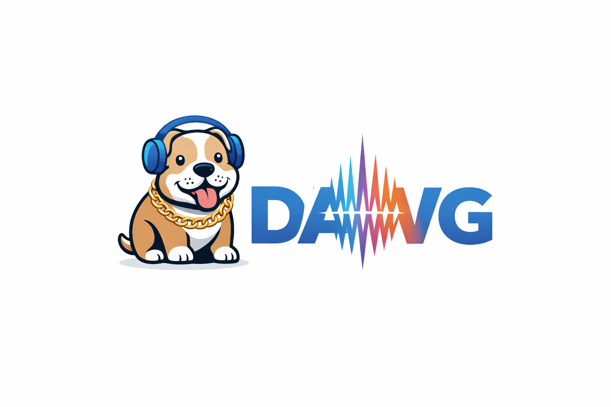

# dawg



Native desktop foundation for a motion-tracked audio tool.

## What we are building

`dawg` is intended to become a video-first audio editing app, not a traditional DAW built around lots of horizontal tracks.

The core idea is that audio should be attached to nodes in the video frame rather than dropped onto a standard timeline track. A node can follow motion in the shot, and that motion can drive audio behavior over time. Examples we want to support include:

- reverb amount changing with perceived distance
- EQ changes driven by position or movement
- doppler-style effects from motion
- panning based on screen position
- delay or timing effects influenced by where the node sits in the frame

In other words, the video image is not just reference material. It is part of the editing model.

## First product direction

The first version should focus on a stable and editable node workflow before trying to become a complete audio workstation.

Priority areas for that first version:

- stable motion tracking
- control over how long a node remains active
- adjustable tracking resolution or cadence
- ability to decide whether tracking happens every frame, every few frames, or at a wider interval such as every few seconds
- keyframe editing with visible lines and handles so tracking mistakes can be corrected manually

These controls will likely end up as project or tracker settings, but the main goal is to make node behavior predictable and easy to correct.

## Open product question

Motion tracking may not be the right first interaction model for every case.

A simpler starting point may be:

- click a node on the screen
- move forward in time
- place the next keyframe manually
- nudge and refine the path by editing handles and keyframes

That means the product should stay open to a hybrid approach:

- automatic tracking when it is reliable
- manual keyframing when the user wants tighter control
- tooling that makes it easy to switch between the two

## First milestone

The initial vertical slice is:

- open a video file
- display frames in a Qt canvas
- click the video to seed a tracking point
- propagate that point forward with OpenCV optical flow while the video plays
- keep the track model ready for later audio attachment

This repository is set up so the next milestone can bind an audio asset to a track and pan or spatialize it from the tracked position.

## Stack

- `Qt 6 Widgets` for the desktop UI and canvas
- `OpenCV` for decoding fallback and optical-flow tracking
- `FFmpeg` wired in at the build level for the later decoder/export path
- `CMake` + `vcpkg` for dependency management on Windows

## Project layout

- `src/app`: main window and playback/controller orchestration
- `src/core/video`: decoder interfaces and the current OpenCV-backed implementation
- `src/core/tracking`: track models and the motion tracker
- `src/ui`: custom video canvas and overlay rendering

## Prerequisites

Install these before building:

- Visual Studio 2022 with Desktop development for C++
- CMake 3.27+
- `vcpkg`

One workable Windows setup path is:

```powershell
winget install Kitware.CMake
winget install Microsoft.VisualStudio.2022.BuildTools
git clone https://github.com/microsoft/vcpkg $env:USERPROFILE\vcpkg
$env:VCPKG_ROOT="$env:USERPROFILE\vcpkg"
& "$env:VCPKG_ROOT\bootstrap-vcpkg.bat"
```

## Build

```powershell
cmake --preset windows-msvc
cmake --build --preset windows-msvc-debug
```

## Dev loop on Windows

If your normal repo path is long enough to upset `Qt` or `vcpkg`, use the repo scripts from your usual checkout and let them build from a short real path automatically:

```powershell
powershell -NoProfile -ExecutionPolicy Bypass -File .\scripts\Build-Dawg.ps1
powershell -NoProfile -ExecutionPolicy Bypass -File .\scripts\Run-Dawg.ps1
powershell -NoProfile -ExecutionPolicy Bypass -File .\scripts\Watch-Dawg.ps1
```

What they do:

- sync your current repo into `C:\dawg-dev\src`
- keep a short-path `vcpkg` checkout in `C:\dv`
- build the app in `C:\dawg-dev\out`
- optionally launch the app when using `Run-Dawg.ps1`
- keep rebuilding, killing, and relaunching the app when using `Watch-Dawg.ps1`

You still edit code in your normal repo. The short-path workspace is just the build mirror.

## Easiest way to start

If you are new to native C++ setup on Windows, use the launcher in the repo root:

- double-click `Open DAWG.cmd`
- double-click `Build DAWG.cmd` if you only want to build for development
- double-click `Watch DAWG.cmd` if you want save -> rebuild -> restart behavior

What it does:

- checks for Git, CMake, and Visual Studio C++ tools
- clones `vcpkg` into `.tools/vcpkg` on first run
- installs/builds the required libraries through the manifest
- builds the app
- opens `dawg.exe`

Notes:

- the first run can take a long time because `Qt`, `OpenCV`, and `FFmpeg` may need to build
- after the first build, launching is much faster
- if something required is missing, the script stops with a plain-English error

## Current behavior

- `Open Video` loads a clip through `cv::VideoCapture`
- clicking the frame creates a seeded track point on the current frame
- `Play` advances frames and runs Lucas-Kanade optical flow from one frame to the next
- tracked points are painted as overlays

## Limits of this scaffold

- no timeline yet
- no reverse tracking yet
- no persisted project/session format yet
- no audio engine yet
- FFmpeg is prepared at the build level, but the runtime decoder still uses OpenCV for the first milestone

## Next steps

1. Replace the temporary decoder path with an FFmpeg-backed frame cache and seek layer.
2. Add a track inspector with confidence state, retrack, and delete actions.
3. Attach an audio asset to each tracked target and map screen position to panning/spatial placement.
4. Add a timeline with keyframes so a user can start or stop tracking from explicit points in the clip.
